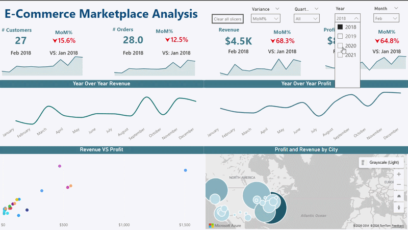
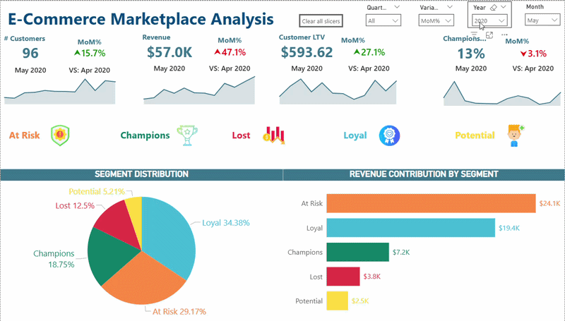
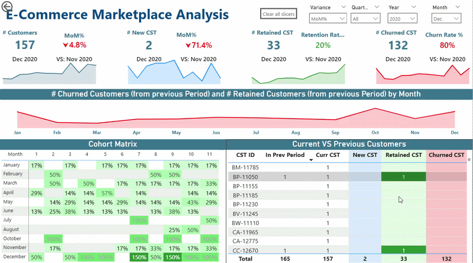

# 📊 E-Commerce Marketplace Analysis

> An end-to-end **Power BI analytics solution** for an online marketplace — covering customer intelligence, RFM segmentation, and executive-level KPI dashboards across 3 interactive report pages.

---

## 🧩 Project Overview

This project analyzes a multi-dimensional e-commerce transactional dataset to surface actionable business insights across **sales performance**, **customer behavior**, and **retention health**. It was built as a full-stack analytics deliverable — from raw data preparation and feature engineering through to machine learning and interactive dashboarding.

**Tools & Technologies:**  
`Power BI` · `DAX` · `Python (pandas, scikit-learn)` · `RFM Analysis`

---
## ⚙️ DAX Architecture — Calculation Groups

To avoid measure explosion across 3 report pages, all time-intelligence and 
variance calculations were consolidated using **DAX Calculation Groups** 
instead of writing individual measures per KPI per variance type.

| Calculation Item | Description |
|-----------------|-------------|
| `MoM%` | Month-over-Month % change |
| `QoQ%` | Quarter-over-Quarter % change |
| `YoY%` | Year-over-Year % change |
| `MTD` | Month-to-Date cumulative value |
| `QTD` | Quarter-to-Date cumulative value |
| `YTD` | Year-to-Date cumulative value |

**Impact:** A single base measure (e.g. `[Revenue]`) automatically inherits 
all 6 variance behaviors via the slicer — replacing what would have been 
6 × N duplicate measures across the model.

---

## 📄 Dashboard Pages

### Page 1 — Executive Overview

> KPI summary, revenue & profit trends, and geographic performance — filterable by Year, Month, Quarter, and Variance mode (QoQ%, YoY%, MoM%, QTD, YTD, MTD).

**What's included:**
- 📦 **# Customers** and **# Orders** with % variances sparklines
- 💰 **Revenue** and **Profit** KPI cards with variances change indicators
- 📈 **Year Over Year Revenue** and **Year Over Year Profit** trend lines (Jan–Dec)
- 🔵 **Revenue VS Profit** scatter plot by product/order
- 🗺️ **Profit and Revenue by City** — bubble map (Microsoft Azure Maps)
- 🎛️ Slicers: Year · Month · Quarter · Variance type (QoQ%, YoY%, MoM%, QTD, YTD, MTD)

---

### Page 2 — Customer Segmentation (RFM)

> RFM-based customer segments with revenue contribution breakdowns — filterable by Year, Month, Quarter, and Variance mode (QoQ%, YoY%, MoM%, QTD, YTD, MTD).

**What's included:**
- 👥 **# Customers** with variances change indicators — May 2020 example: 96 customers, ▲15.7%
- 💵 **Revenue** and **Customer LTV** with variances change indicators trends
- 🏆 **Champions %** — share of highest-value customers
- 🎨 **RFM Segment Icons** — At Risk · Champions · Lost · Loyal · Potential
- 🥧 **Segment Distribution Pie Chart** — % breakdown across all 5 segments
- 📊 **Revenue Contribution by Segment** — horizontal bar chart (At Risk: $24.1K | Loyal: $19.4K | Champions: $7.2K ...)

---

### Page 3 — Retention & Churn Analysis

> Monthly cohort retention curves, churn/retention KPIs, and a customer-level drill-through table.

**What's included:**
- 🔢 **# Customers** · **# New CST** · **# Retained CST** · **# Churned CST** KPI cards
- 📉 **Retention Rate** and **Churn Rate %** with variances change indicators — Dec 2020: Retention 20% | Churn 80%
- 📈 **Churned vs Retained Customers by Month** — dual area/line chart (Jan–Dec)
- 🧮 **Cohort Matrix** — monthly cohort retention heatmap (% retained per cohort over 11 months)
- 🧾 **Current VS Previous Customers Table** — customer-level detail: In Prev Period · Curr CST · New CST · Retained CST · Churned CST

---

## 📐 KPIs Defined

| KPI | Definition |
|-----|-----------|
| **Active Customers** | Customers with at least one order in the selected period |
| **New Customers** | Customers whose first-ever order falls in the selected period |
| **Churn Rate** | % of prior-period customers who did not purchase in the current period |
| **Retention Rate** | % of prior-period customers who returned to purchase again |
| **AOV** | Total Revenue ÷ Number of Orders |
| **Customer LTV** | Total revenue per customer averaged over their full order history |
| **Champions %** | Share of customers classified as Champions in the RFM model |

---

## 🧠 RFM Segmentation Logic

Customers are scored on **Recency**, **Frequency**, and **Monetary** value and assigned to one of five tiers:

| Segment | Criteria |
|---------|----------|
| 🏆 **Champions** | Bought recently, buy often, spend the most |
| 💙 **Loyal** | Buy regularly, good monetary value |
| ⚠️ **At Risk** | Were frequent buyers but haven't purchased recently |
| 🔴 **Lost** | Last purchased long ago, low engagement |
| 🟡 **Potential** | Recent first-timers with growth potential |

---

## 💡 Key Business Recommendations

1. **Churn reduction** — "At Risk" customers (29% of base) generate $24.1K; targeted win-back campaigns (personalized discounts, reactivation emails) are the highest-ROI lever.
2. **Category focus** — Technology and Office Supplies show strongest profit margins; prioritize promotional budget here over Furniture.
3. **Discount strategy** — Discounts above 20% consistently compress margins without proportional volume gains; implement discount floors by sub-category.
4. **Regional gaps** — Western cities dominate bubble map revenue; Central/South regions are underserved and represent expansion opportunity.
5. **Shipping optimization** — Standard Class is the dominant mode; benchmarking satisfaction scores against Second Class can guide SLA improvements.

---

## 🚀 Getting Started

1. Clone this repository
2. Open `Report.pbix` in **Power BI Desktop** (May 2024+ recommended)
3. Connect to your data source or use the included sample dataset
4. Use the slicers (Year · Month · Quarter · Variance) to explore KPIs interactively

---
